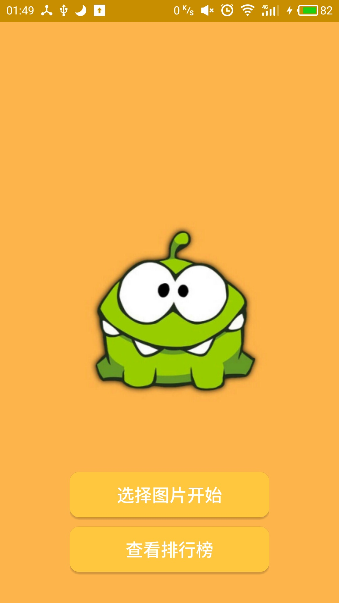
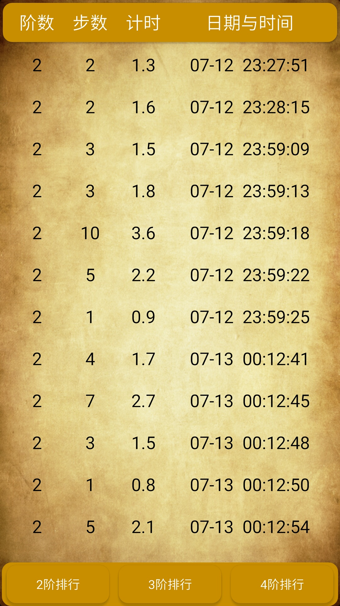
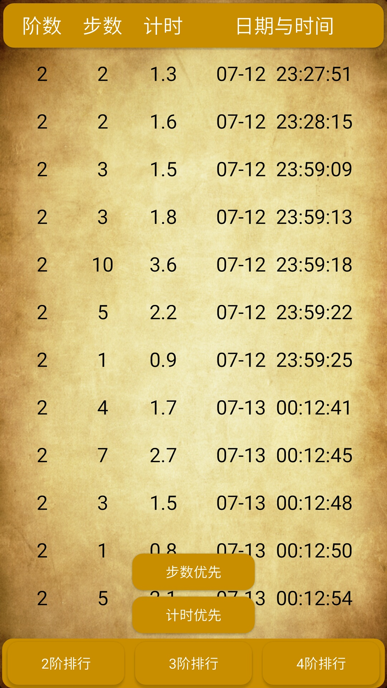
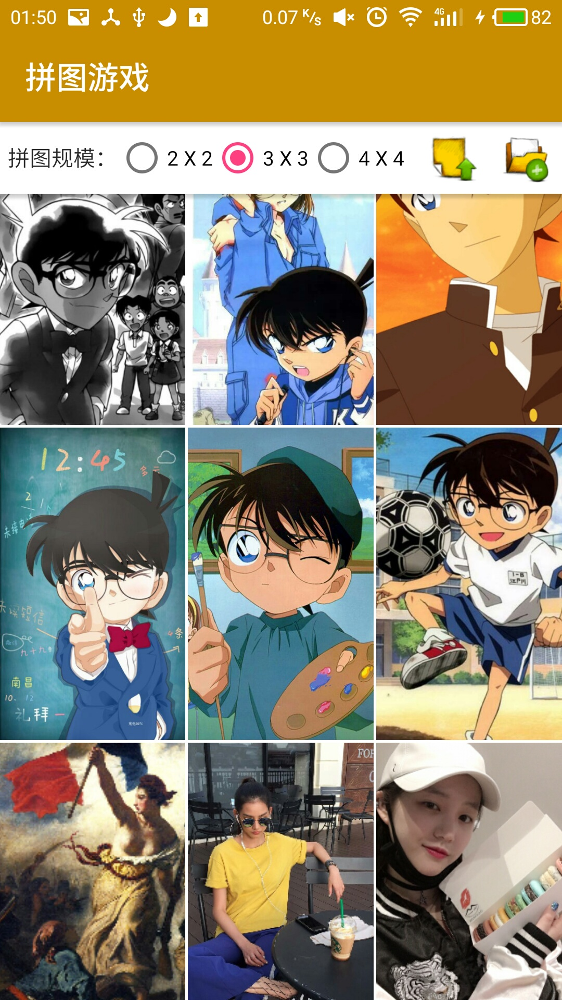
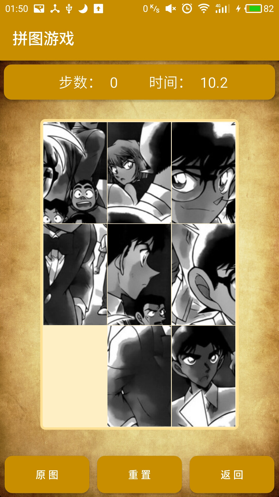
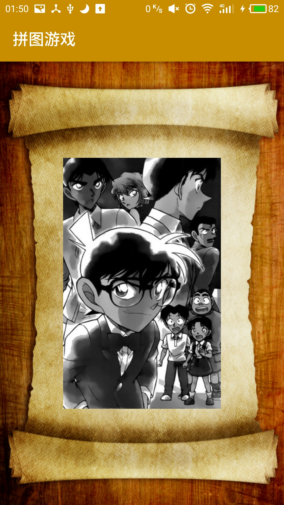

A PUZZLE GAME
===

# 刚进入App:

# 进入排行榜:

# 排行榜是可以以优先步数或者优先计时来排名:

# 游戏开始前进行图片选择，提供了自带图片和网络图片，也可以点右上角文件夹选择相册或者相机图片:
###### 使用RecyclerView的Grid模式，网络图片使用三级缓存，自动清理显示范围较远的图片释放内存防止内存泄露以避免OOM

# 游戏可以查看原图或者重置，结束后会将步数和时间记录起来:
###### 使用RecyclerView，点击Item有平移动画效果，并使用通知局部刷新避免了整体刷新时其他Item位置测量的不稳定
###### 通过测量原图比例修改拼图碎片的比例即可居中且完整展示图片

# 原图查看界面,轻触图片或者按手机返回键返回:

